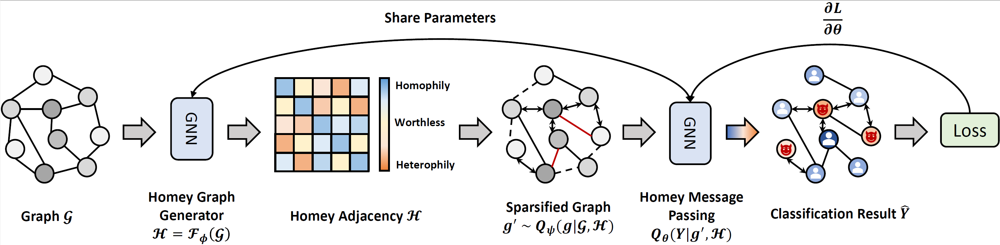

# SparseGAD

This is the source code of IJCAI'23 paper "Beyond Homophily: Robust Graph Anomaly Detection via Neural Sparsification".



## Requirements
This code requires the following:
* Python==3.7.15
* Pytorch==1.10.1
* Pytorch Geometric==2.0.4
* DGL==0.8.2
* Numpy==1.21.5
* Scikit-learn==1.0.2
* Scipy==1.7.3

## Usage
Just run the script corresponding to the dataset you want. For instance:

```
bash scripts/amazon_train_0.4.sh
```

## Cite

If you compare with, build on, or use aspects of this work, please cite the following:
```
@inproceedings{gong2023beyond,
  title={Beyond Homophily: Robust Graph Anomaly Detection via Neural Sparsification},
  author={Gong, Zheng and Wang, Guifeng and Sun, Ying and Liu, Qi and Ning, Yuting and Xiong, Hui and Jingyu Peng},
  booktitle={Proceedings of the Thirty-Second International Joint Conference on Artificial Intelligence, IJCAI},
  year={2023}
}
```